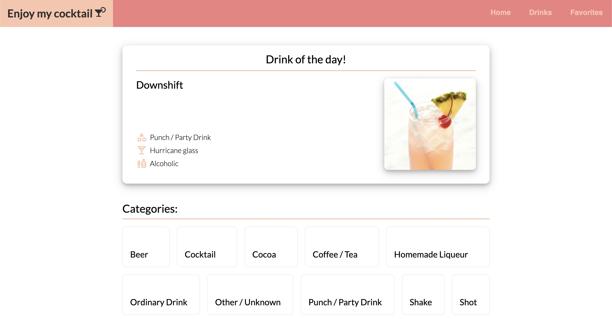

# Enjoy my cocktail 

Welcome to Enjoy my cocktail!

This is an application to browse a wide variety of drinks, and maybe get some inspiration for you home bar!🍹



> Visit the site at [https://cocktail.magnusbyrkjeland.no](https://cocktail.magnusbyrkjeland.no)! 🍸

## Contributors

| <div style="width:180px">Full Name</div>              | Email                 |
| ----------------------------------------------------- | --------------------- |
| [Magnus Tomter Ouren](https://github.com/magnusouren) | magnutou@stud.ntnu.no |
| [Ole Remi Dahl](https://github.com/oleremidahl)       | olerd@stud.ntnu.no    |
| [Jakob Relling](https://github.com/Jakob-ere)         | jakobere@stud.ntnu.no |
| [Magnus Byrkjeland](https://github.com/sleipner01)    | magnueb@stud.ntnu.no  |

## API

The data used in the application is retrieved from [The Cocktail DB](https://www.thecocktaildb.com/).

## Technologies

The project uses the following technologies:

- [Bun](https://bun.sh/) for package management and running scripts
- [React 19](https://react.dev/) with [TypeScript](https://www.typescriptlang.org/)
- [Vite](https://vite.dev/) for development and bundling
- [React Router](https://reactrouter.com/) for routing
- [TanStack Query](https://tanstack.com/query/latest) for data fetching and caching
- [Vitest](https://vitest.dev/), [Testing Library](https://testing-library.com/) and [MSW](https://mswjs.io/) for testing
- [ESLint](https://eslint.org/), [Stylelint](https://stylelint.io/) and [Prettier](https://prettier.io/) for code quality

## Requirements

The only requirement is [Bun](https://bun.sh/) (v1.4 or newer). Install it with:

```bash
curl -fsSL https://bun.sh/install | bash
```

Node.js and npm are not needed.

## Start development

Install dependencies:

```bash
bun install
```

Start the development server:

```bash
bun run dev
```

Vite prints the local URL in the terminal (usually [http://localhost:5173](http://localhost:5173)). Code changes are reloaded in the browser automatically.

## Available Scripts

### Development

| Command       | Description                                            |
| ------------- | ------------------------------------------------------ |
| `bun install` | Installs all dependencies.                             |
| `bun run dev` | Starts the Vite development server with hot reloading. |
| `bun start`   | Alias for `bun run dev`.                               |

### Testing

| Command            | Description                                                                                  |
| ------------------ | -------------------------------------------------------------------------------------------- |
| `bun run test`     | Runs the tests with Vitest in watch mode.                                                    |
| `bun run test run` | Runs the tests once and exits.                                                               |
| `bun run coverage` | Runs the tests once and generates a coverage report in [`coverage/`](./coverage/index.html). |

> Use `bun run test`, not `bun test`. `bun test` starts Bun's built-in test runner, which does not use the Vitest setup this project relies on.

### Code Quality

| Command                | Description                                                     |
| ---------------------- | --------------------------------------------------------------- |
| `bun run lint`         | Runs ESLint. Fails on any error or warning.                     |
| `bun run lint:fix`     | Runs ESLint and fixes what it can automatically.                |
| `bun run lint:css`     | Runs Stylelint on the CSS files.                                |
| `bun run lint:css:fix` | Runs Stylelint and fixes what it can automatically.             |
| `bun run format`       | Formats the source files with Prettier using `.prettierrc.cjs`. |

### Production

| Command            | Description                                                          |
| ------------------ | -------------------------------------------------------------------- |
| `bun run build`    | Lints, type checks and builds the project. See below.                |
| `bun run build:ci` | Builds the project with Vite only, skipping linting and type checks. |
| `bun run preview`  | Serves the production build locally. Run `bun run build` first.      |

## Prepare for production

Build the project with:

```bash
bun run build
```

This runs the following steps and stops at the first failure:

1. ESLint on the TypeScript files.
2. Stylelint on the CSS files.
3. Type checking with `tsc`.
4. Bundling with Vite into `dist/`.

Then preview the production build locally with:

```bash
bun run preview
```

The live site is deployed on [Vercel](https://vercel.com/), configured in [`vercel.json`](./vercel.json).

### A note on TypeScript versions

`tsc` runs TypeScript 7 (installed as `@typescript/native`). The `typescript` package is aliased to TypeScript 6 because typescript-eslint does not support TypeScript 7 yet. Once it does, the alias can be removed.

## Filestructure

This project follows a specific file structure. This section provides an overview of the file structure and describes what should be in the various folders and files. It also describes how testing is performed in the project.

- [Project filestructure](./docs/filestructure-project.md)
- [Component filestructure](./docs/filestructure-component.md)

## Query caching

We have implemented query caching in the application. This means that when a user searches for a drink, category, etc., the application will cache the query and the result. If the user searches for the same drink again, the application will use the cached result instead of making a new request to the API. This will improve the performance of the application.

The caching is implemented using tanstack QueryClient with SyncStoragePersister. Read more about it [here](https://tanstack.com/query/latest/docs/react/plugins/persistQueryClient?from=reactQueryV3&original=https%3A%2F%2Ftanstack.com%2Fquery%2Fv3%2Fdocs%2Fplugins%2FpersistQueryClient).

## Responsiveness

The user experience and responsivness of the application have been tested using Chrome Devtools and our personal mobile phones (iPhone 12).

## Feedback and improvements after first delivery

[Feedback and improvements](./docs/feedback.md)
